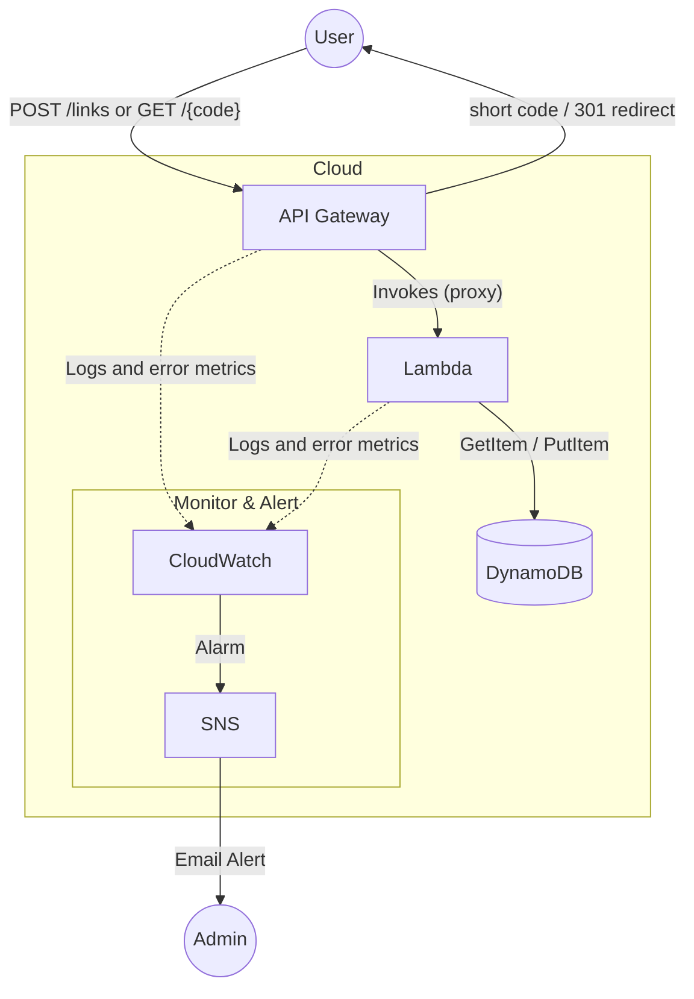

# AWS Serverless URL Shortener
Serverless URL Shortener (API Gateway + Lambda + DynamoDB)

## 1. Overview
A serverless URL shortener using AWS's API Gateway + Lambda + DynamoDB with a GitHub Actions workflow to catch mistakes, ensure security best practices and mimic production environments.

## 2. Architecture diagram

## 3. Tech stack
- Terraform
    - TFLint
- AWS
    - API Gateway
    - Lambda
    - DynamoDB
    - OIDC
    - CloudWatch
    - SNS
    - S3 Bucket (for .tfstate)
- Python
    - Pytest
- Checkov
- Github Actions

## 4. Design decisions
### Why modules?
I chose modules because having everything in `main.tf` was getting pretty messy. I was calling resources and data statically instead of dynamically. This is fine for a personal project but should I ever want to expand having modules reduces the technical debt and improves legibility.

## 5. CI/CD pipeline

## 6. Security

## 7. Problems I hit

## 8. Future improvements

## 9. How to deploy it yourself